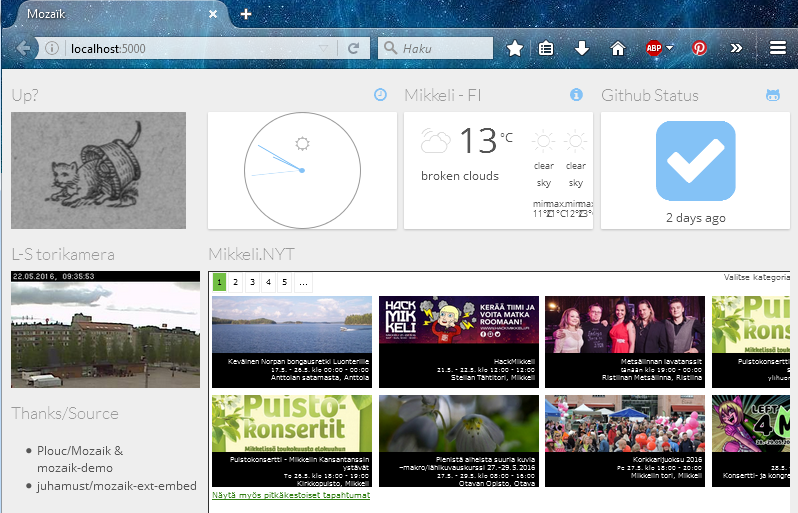
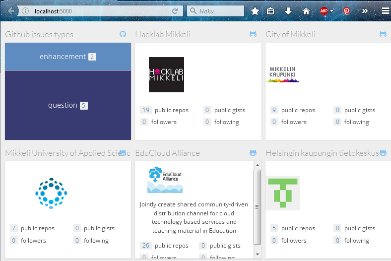

# upgraded-jubileum
Simple dashboard experiment

The basics from plouc/mozaik and especially plouc/mozaik-demo . This is just a local configuration usage experiment, therefore
not (at the moment) a fork. Mozaik-ext-embed is also highly thanked.

Shows locally a dashboard of chosen things, like

## todo 

You (probably) need to clone mozaik-demo first, and then copy contents from here over it.

> npm install 

> gulp build

> node app.js

## Other remarks

Has been seen to work on my machine, windows 7, with npm 2.15.1 & node 4.4.3 

